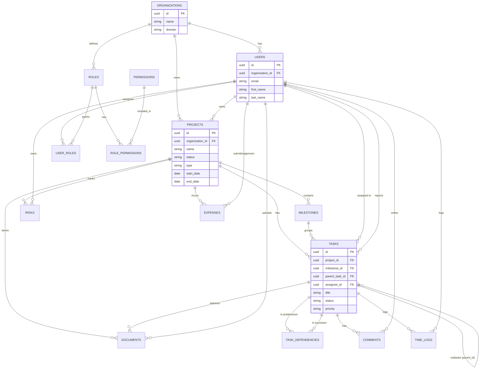

# Entity Relationship Diagram

The following diagram visualizes the core database relationships for the Project Management Platform.

```mermaid
erDiagram
    ORGANIZATIONS ||--o{ USERS : "has"
    ORGANIZATIONS ||--o{ PROJECTS : "owns"
    ORGANIZATIONS ||--o{ ROLES : "defines"
    
    USERS ||--o{ USER_ROLES : "assigned"
    ROLES ||--o{ USER_ROLES : "grants"
    ROLES ||--o{ ROLE_PERMISSIONS : "has"
    PERMISSIONS ||--o{ ROLE_PERMISSIONS : "included_in"

    PROJECTS ||--o{ MILESTONES : "contains"
    PROJECTS ||--o{ TASKS : "has"
    PROJECTS ||--o{ RISKS : "tracks"
    PROJECTS ||--o{ EXPENSES : "incurs"
    PROJECTS ||--o{ DOCUMENTS : "stores"
    
    USERS ||--o{ PROJECTS : "owns"
    
    MILESTONES ||--o{ TASKS : "groups"
    
    TASKS ||--o{ TASKS : "subtasks (parent_id)"
    TASKS ||--o{ TASK_DEPENDENCIES : "is predecessor"
    TASKS ||--o{ TASK_DEPENDENCIES : "is successor"
    TASKS ||--o{ COMMENTS : "has"
    TASKS ||--o{ TIME_LOGS : "logs"
    TASKS ||--o{ DOCUMENTS : "attaches"
    
    USERS ||--o{ TASKS : "assigned to"
    USERS ||--o{ TASKS : "reports"
    USERS ||--o{ COMMENTS : "writes"
    USERS ||--o{ TIME_LOGS : "logs"
    USERS ||--o{ RISKS : "owns"
    USERS ||--o{ EXPENSES : "submits/approves"
    USERS ||--o{ DOCUMENTS : "uploads"

    ORGANIZATIONS {
        uuid id PK
        string name
        string domain
    }

    USERS {
        uuid id PK
        uuid organization_id FK
        string email
        string first_name
        string last_name
    }

    PROJECTS {
        uuid id PK
        uuid organization_id FK
        string name
        string status
        string type
        date start_date
        date end_date
    }

    TASKS {
        uuid id PK
        uuid project_id FK
        uuid milestone_id FK
        uuid parent_task_id FK
        uuid assignee_id FK
        string title
        string status
        string priority
    }
```
